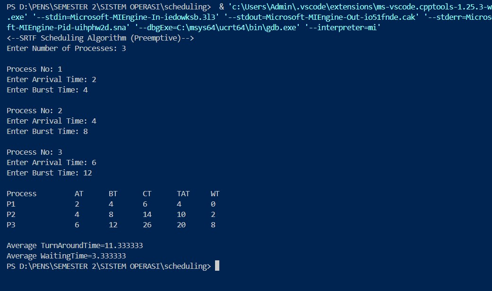

# scheduling-algorithms

nama : salsabilla zahratul ramadhani
nrp : 3124521013
Kelas : IT A

## 1.SJF without arrival time (non-preemptive)

### kode program :

### output :

analisa : Program C ini mensimulasikan algoritma penjadwalan Shortest Job First (SJF) secara non-preemptive, dengan asumsi semua proses tiba pada waktu nol.

Program dimulai dengan mendefinisikan struktur proc untuk menyimpan detail proses seperti nomor proses, waktu burst (burst time), waktu penyelesaian (completion time), waktu penyelesaian total (turn-around time), dan waktu tunggu (waiting time).

Fungsi read bertanggung jawab untuk secara interaktif menerima masukan waktu burst untuk setiap proses.

Dalam fungsi main, setelah mendapatkan total jumlah proses, program membaca waktu burst untuk setiap proses. Yang terpenting, program kemudian mengimplementasikan algoritma bubble sort untuk mengatur proses-proses dalam urutan menaik berdasarkan waktu burst mereka.

Setelah pengurutan ini, program mengulang (iterate) melalui proses-proses yang telah diurutkan untuk menghitung:

Waktu penyelesaian (completion time)
Waktu penyelesaian total (turn-around time), yang sama dengan waktu penyelesaian karena waktu kedatangan adalah 0
Waktu tunggu (waiting time)
Akhirnya, program mencetak tabel yang merangkum metrik-metrik ini untuk setiap proses dan menghitung serta menampilkan rata-rata waktu penyelesaian total dan rata-rata waktu tunggu untuk semua proses.

## 2.SJF with arrival time (non-prremptive)

### kode program :

### output :

analisa : Program C ini menyimulasikan algoritma penjadwalan Shortest Job First (SJF) non-preemptive, dengan secara eksplisit memasukkan waktu kedatangan proses untuk menentukan urutan eksekusi.

Program dimulai dengan mendefinisikan struktur proc untuk menyimpan detail setiap proses, termasuk nomor proses, waktu kedatangan (arrival time), waktu burst (burst time), waktu mulai awal (initial start time), waktu penyelesaian (completion time), waktu penyelesaian total (turn-around time), dan waktu tunggu (waiting time).

Setelah mengumpulkan jumlah proses dan waktu kedatangan serta waktu burst masing-masing dari pengguna, program awalnya mengurutkan semua proses berdasarkan waktu kedatangan mereka. Selanjutnya, ini memastikan bahwa di antara proses-proses yang tiba secara bersamaan pada waktu paling awal, proses dengan waktu burst terpendek dijadwalkan terlebih dahulu.

Loop penjadwalan utama kemudian secara iteratif memilih pekerjaan terpendek dari kumpulan proses yang sudah tiba pada waktu penyelesaian proses yang dieksekusi sebelumnya. Untuk setiap proses yang dipilih, waktu eksekusi awalnya dihitung, memperhitungkan potensi waktu idle CPU jika proses tiba setelah proses sebelumnya selesai.

Setelah itu, program menghitung:

Waktu penyelesaian (completion time)
Waktu penyelesaian total (turn-around time), yaitu waktu penyelesaian dikurangi waktu kedatangan
Waktu tunggu (waiting time), yaitu waktu penyelesaian total dikurangi waktu burst
Terakhir, program menyajikan tabel komprehensif yang merangkum metrik-metrik ini untuk semua proses dan menghitung rata-rata waktu penyelesaian total serta rata-rata waktu tunggu secara keseluruhan, memberikan simulasi lengkap algoritma SJF non-preemptive dengan waktu kedatangan yang dinamis.

## 3.STRF (preemptive) contoh kasus sesuaikan dengan PPT

### kode program :

### output :

analisa : Program C ini secara cermat menyimulasikan algoritma penjadwalan Shortest Remaining Time First (SRTF), yang merupakan varian preemptive dari Shortest Job First, dengan secara eksplisit memasukkan waktu kedatangan proses.

Program ini mendefinisikan struktur proc untuk menyimpan detail setiap proses, termasuk nomor proses, waktu kedatangan (arrival time), total waktu burst (burst time), sisa waktu burst (remaining burst time), waktu penyelesaian (completion time), waktu penyelesaian total (turn-around time), dan waktu tunggu (waiting time). Sisa waktu burst diinisialisasi dengan waktu burst total.

Setelah mengumpulkan jumlah proses dan waktu kedatangan serta waktu burst masing-masing dari pengguna, proses-proses awalnya diurutkan berdasarkan waktu kedatangan mereka.

Inti dari logika SRTF diimplementasikan dalam loop berbasis waktu yang mensimulasikan eksekusi CPU. Pada setiap unit waktu, program secara dinamis mengidentifikasi proses yang telah tiba dan saat ini memiliki sisa waktu burst terpendek di antara semua proses yang tersedia. Proses yang dipilih ini kemudian diizinkan untuk dieksekusi selama satu unit waktu, mengurangi sisa waktu burst-nya.

Mekanisme evaluasi ulang dan pemilihan yang berkelanjutan ini secara inheren mengimplementasikan preemption, memungkinkan CPU untuk beralih ke proses yang baru tiba atau yang saat ini tersedia jika sisa waktunya lebih pendek dari proses yang sedang berjalan.

Ketika sebuah proses selesai dieksekusi (sisa waktunya menjadi nol), waktu penyelesaiannya dicatat, dan waktu penyelesaian total serta waktu tunggunya dihitung dan diakumulasikan untuk rata-rata keseluruhan.

Akhirnya, program mengeluarkan tabel rinci yang menampilkan metrik-metrik ini untuk setiap proses dan menyajikan rata-rata waktu penyelesaian total dan rata-rata waktu tunggu yang dihitung untuk seluruh set proses.

